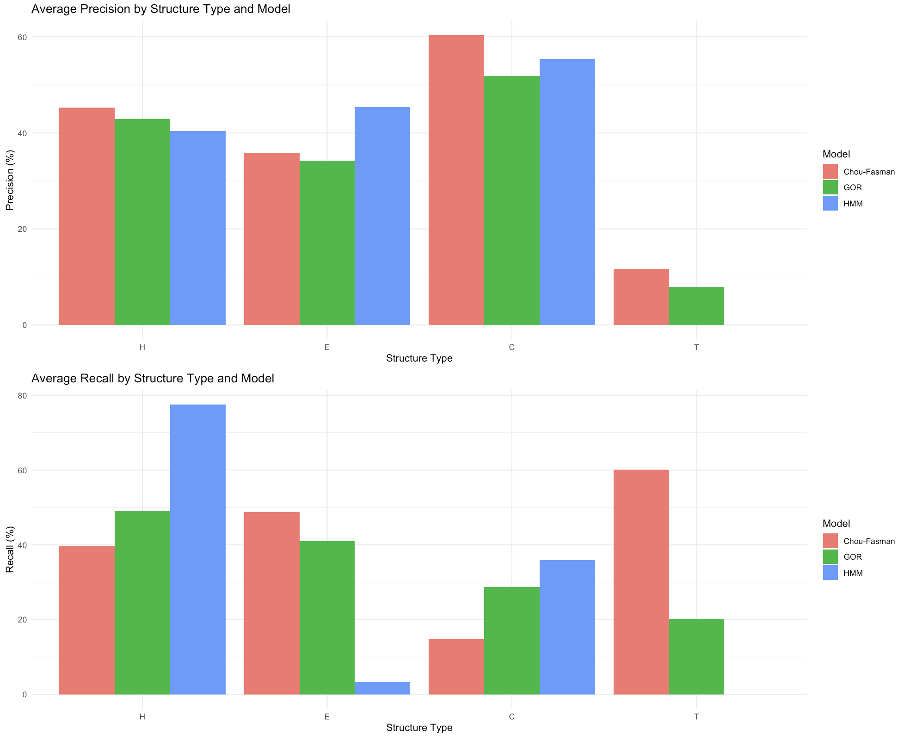

# Detailed Analysis Report

## Introduction

This report provides a comprehensive analysis of the ab initio secondary structure prediction models implemented in this repository, focusing on the Chou-Fasman (CF) and GOR models.

## Model User Interface and Results

**Figure 1:** RShiny User Interface, showing the input protein sequence, and the outputs. The outputs include the predicted sequences from all three models, the percentage of matching characters between them, and a visual comparison of the matching percentage.

**Figure 2:** Character composition (percentage of H, E, C and Ts) of predicted sequences by CF, GOR, and HMM models.

## Model Validation Results

The following figures illustrate models' performance metrics when tested against a validation dataset of 50 proteins with their corresponding "ground-truth" 2D structure sequence strings from the DSSP database.

**Figure 3:** Performance Metrics used for model validation and the rationale for using those metrics.

**Figure 4:** Bar graph showing the Accuracy(in %) of the three structure prediction models across 50 protein sequences.

**Figure 5:** Table of Accuracy Metrics for the three models.

**Figure 6:** Bar graph showing average percentage accuracy and scatterplot showing percentage accuracy for each of the 50 proteins for each of the three models.

**Figure 7:** a. Bar graph depicting the average precisions of predicting H, E, C and Ts across 3 models for 50 proteins. b. Bar graph showing the average recall for each structure type, across 50 proteins.

**Figure 8:** Bar graph depicting the average F-1 scores of each structure type across the three models for 50 proteins.

## Conclusion

In this study, we evaluated three classical models—Chou-Fasman (CF), Garnier-Osguthorpe-Robson (GOR), and Hidden Markov Model (HMM)—for protein secondary structure prediction. By comparing the CF, GOR, and HMM methods, we have demonstrated the varying degrees of accuracy and limitations inherent in each approach. The Chou-Fasman model, while pioneering, shows lower accuracy due to its reliance on static propensity values (from a small dataset) without considering sequence context. In contrast, the GOR method leverages local sequence context through statistical analysis, resulting in improved prediction accuracy. However, its dependence on local interactions limits its ability to account for long-range structural influences. The experimental HMM approach, promising due to its probabilistic framework, surprisingly outperformed both previous models. However, it exhibited high variance, reflecting the need for parameter optimization and training on larger datasets. Future directions include implementing the advanced versions of CF and GOR models, and refining the HMM with advanced training algorithms like Baum-Welch. All of the models could also be enhanced by integrating modern machine learning techniques to improve accuracy and generalizability.

Despite these challenges, the exploration of these classical algorithms provides valuable insights into the progression of computational biology and sets a benchmark for evaluating more advanced machine learning models like AlphaFold2. The field has seen remarkable advancements with machine learning models achieving up to 84% accuracy in secondary structure prediction, while AlphaFold by DeepMind has revolutionized tertiary structure prediction with an astonishing 99% accuracy, setting a benchmark for AI-driven approaches. Emerging trends include using attention-based architectures and large language models (LLMs), which offer faster and potentially more accurate predictions.  Hence, this project emphasizes the importance of integrating historical methods with contemporary technologies to enhance our understanding and prediction of protein structures.

