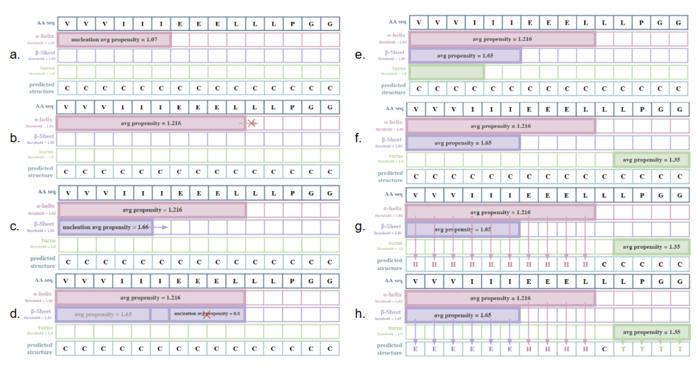
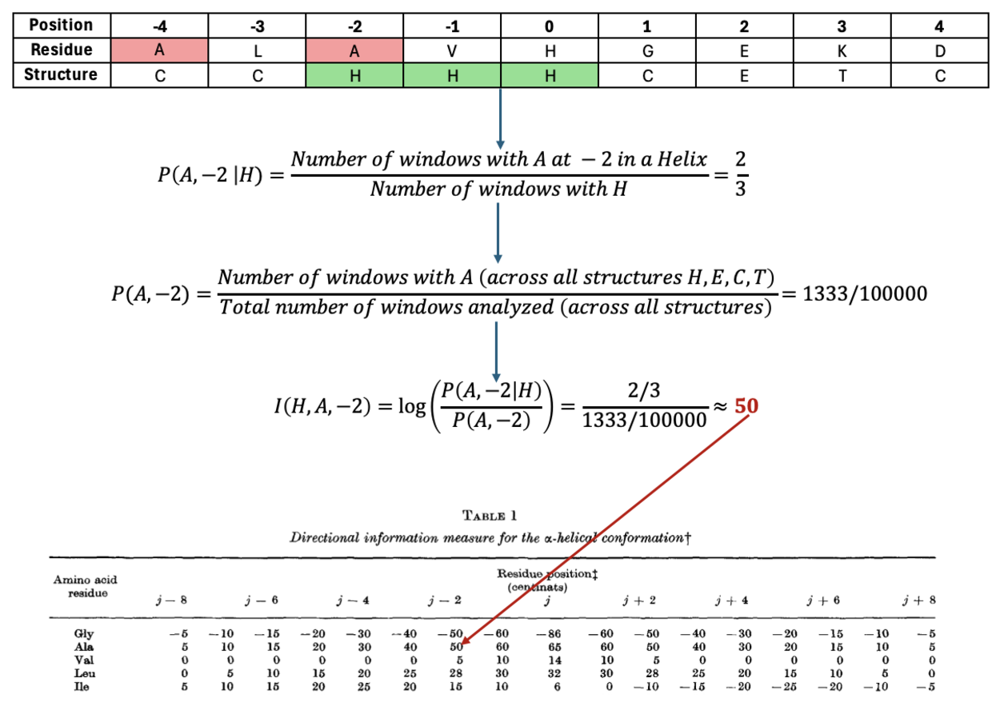
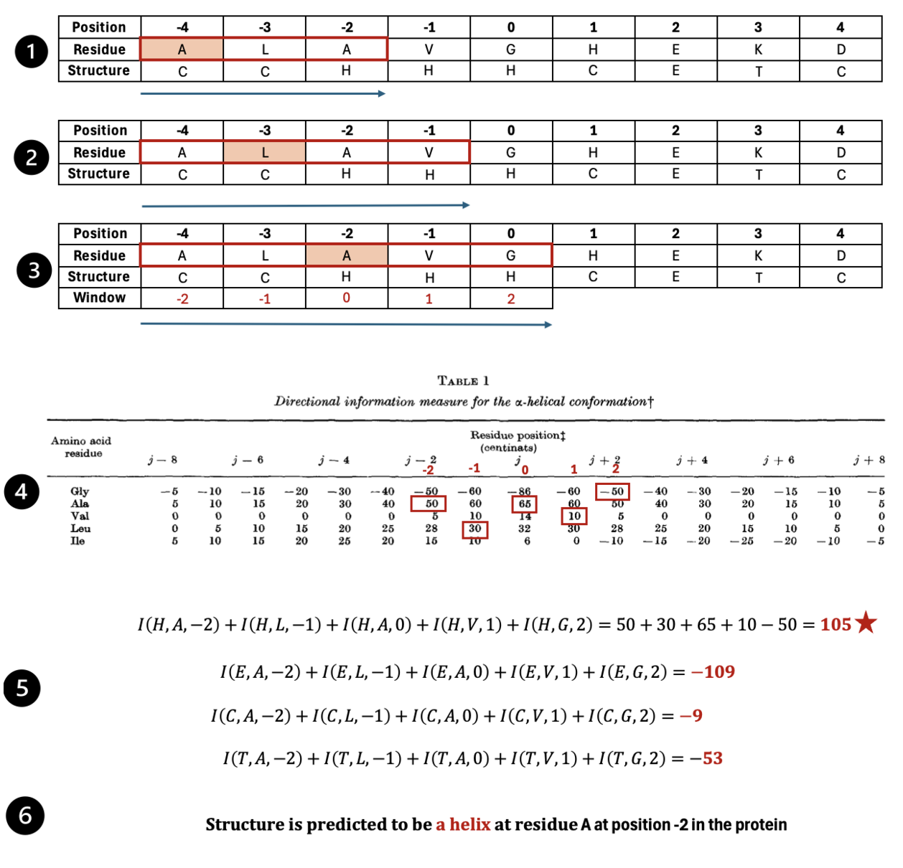

# Group 2: Protein Secondary Structure Prediction
# Date: 12th December, 2024
# Members: Arth Banka, Riti Bhatia, Sanchitha Kuthethoor, Sumeet Kothare

# Demo link: https://drive.google.com/file/d/1X8fdxQFILHfyiLvSTlYzYjZ6NzGQ1mI8/view?usp=drive_link 

## Project Motivation
In this project, we were motivated by a central theme: predicting the secondary structure of proteins from their amino acid sequences using straightforward, pre-defined heuristic methods. Rather than relying on modern, data-intensive machine learning approaches, we chose to revisit and implement earlier, “classic” algorithms—such as Chou-Fasman, GOR, and simple Hidden Markov Models (HMMs)—to assess their predictive accuracy against established “ground-truth” or industry-standard predictions (e.g., derived from DSSP or reliable online prediction tools). This historical and heuristic-driven perspective allows us to understand how early computational biology tackled a complex prediction problem without the luxury of advanced machine learning frameworks.

## Computational Problem
Given an input amino acid sequence (a string of single-letter amino acid codes), produce an output string indicating the secondary structure state (e.g., H, E, T, C for helix, strand, turn, coil) for each residue. The objective is to maximize the percentage match between this predicted structure and the actual experimentally validated structure. We operate under minimal computational overhead and use models that rely on relatively simple statistical insights or state-based frameworks, without large-scale model training.

## Folder Structure

```
AbInitioPS/
├── Figures/
│   ├── Miscellaneous ".png" files
├── GOR_InfoVals/
│   ├── InfoVal_aHelix.csv
│   ├── InfoVal_bStrand.csv
│   ├── InfoVal_bTurn.csv
│   ├── InfoVal_Coil.csv
├── GORTests/
│   ├── GORPredict/
│   │   ├── Input/
│   │   ├── Output/
│   ├── SlideWindow/
│       ├── Input/
│       ├── Output/
├── .RData
├── .Rhistory
├── AccuracyTestDataset_50.csv
├── AppUI.R
├── auto_Validation.R
├── CF_functions_test.go
├── CF_functions.go
├── datatypes.go
├── EM_main.go
├── GOR_functions_test.go
├── GOR_functions.go
├── AbInitioPS
├── hmm_functions_test.go
├── HMM_functions.go
├── main.go
├── README.md
```

## Description of Files

- **`CF_functions.go`**: Implements the Chou-Fasman algorithm for secondary structure prediction.
- **`CF_functions_test.go`**: Unit tests for `CF_functions.go`.
- **`datatypes.go`**: Contains shared data types used across different modules.
- **`EM_main.go`**: Runs the Expectation-Maximization (EM) algorithm for HMM training.
- **`GOR_functions.go`**: Implements the GOR method for secondary structure prediction.
- **`GOR_functions_test.go`**: Unit tests for `GOR_functions.go`.
- **`HMM_functions.go`**: Implements the HMM model and algorithms for secondary structure prediction.
- **`hmm_functions_test.go`**: Unit tests for `HMM_functions.go`.
- **`main.go`**: Main entry point to the application. Integrates and executes different models.
- **`AppUI.R`**: R Shiny application for running the prediction algorithms via a user interface.
- **`auto_Validation.R`**: R Shiny application for validating model performance using metrics like precision, recall, and F1-score.
- **`AccuracyTestDataset_50.csv`**: Example dataset used for testing.
- **`GOR_InfoVals/`**: Contains CSV files with informational values for different secondary structure types (e.g., Helix, Strand, Turn, Coil).
- **`GORTests/GORPredict/Input/`**: Input test files for GOR prediction module.
- **`GORTests/GORPredict/Output/`**: Output test files for GOR prediction module.
- **`GORTests/SlideWindow/Input/`**: Input test files for sliding window functions.
- **`GORTests/SlideWindow/Output/`**: Output test files for sliding window functions.

## Instructions for Building and Running the Go Code

### Prerequisites
- **Go** (1.18 or higher)
- **Operating System**: macOS or Windows

### Build the Code
1. Open a terminal (macOS) or Command Prompt/PowerShell (Windows).
2. Navigate to the folder containing `main.go`.
3. Run the following command to build the application:
   ```sh
   go build -o Group2 main.go
   ```

### Run the Code
1. Execute the built binary with the input sequence as an argument:
   For macOS/Linux:
   ```sh
   ./Group2 "ETGTVPAINYLGAGYDHVRGNPVGDPSSMGDPGIRPPVLRF"
   ```
   For Windows:
   ```sh
   Group2.exe "ETGTVPAINYLGAGYDHVRGNPVGDPSSMGDPGIRPPVLRF"
   ```
   Replace the input sequence with your desired sequence.

## Running Tests

### Run all tests in the package:
```sh
go test ./...
```

### Run tests for a specific file (e.g., `CF_functions_test.go`):
```sh
go test -v CF_functions_test.go
```

## Using VS Code to Load and Run the Group2 Package

### Prerequisites
- Install **Visual Studio Code**.
- Install the **Go extension** for VS Code.
- Ensure **Go** is properly installed and added to your system PATH.

### Steps to Load the Group2 Package in VS Code
1. Open **Visual Studio Code**.
2. Click **File > Open Folder** and select the `Group2` folder.
3. Ensure the Go extension detects the project and prompts for setting up the environment.
4. Verify the `main.go` file is present in the project root.

### Build the Code in VS Code
1. Open the terminal in VS Code (**View > Terminal** or `Ctrl + ``).
2. Run the following command to build the project:
   ```sh
   go build -o Group2 main.go
   ```

### Run the Program in VS Code
1. In the terminal, execute the built binary with the input sequence:
   ```sh
   ./Group2 "ETGTVPAINYLGAGYDHVRGNPVGDPSSMGDPGIRPPVLRF"
   ```
   Replace the input sequence as needed.

### Run Tests in VS Code
1. Open the terminal.
2. Run the following command to execute all tests:
   ```sh
   go test ./...
   ```
3. To test a specific file, run:
   ```sh
   go test -v CF_functions_test.go
   ```

## Running R Shiny Applications

### Prerequisites
- **R** (version 4.1 or higher)
- **R Shiny package** installed (`install.packages("shiny")`)
- Additional R libraries: `ggplot2`, `reshape2`.

### Run `AppUI.R`
1. Open RStudio.
2. Load `AppUI.R`.
3. Click **Run App**.
4. Use the interface to:
   - Enter a protein sequence or upload a FASTA file.
   - Choose models (`Chou-Fasman`, `GOR`, or `HMM`).
   - View predicted secondary structures and comparison graphs.

#### Inputs
- **Protein sequence** (text or FASTA file).
- **Model selection** (`Chou-Fasman`, `GOR`, `HMM`).

#### Outputs
- Predicted secondary structures.
- Comparison graphs and character composition graphs.

### Run `auto_Validation.R`
1. Open RStudio.
2. Load `auto_Validation.R`.
3. Click **Run App**.
4. Upload a CSV file with the following columns:
   - **ProteinName**: Name of the protein.
   - **ProteinSequence**: Original sequence.
   - **DSSPSequence**: True secondary structure sequence.

#### Outputs
- **Per-protein accuracy**.
- **Average accuracy per model**.
- **Graphs for precision, recall, and F1-score**.

## Mechanisms of Chou-Fasman (CF) and Garnier-Osguthorpe-Robson (GOR) Models

### Chou-Fasman Algorithm


**Figure 1:** A figure depicting the overall Chou Fasman algorithm (note: steps have been skipped). a. Shows the favourable helix nucleation site, b. Shows the final extended helix window, c. Shows the favourable sheet nucleation site, d. Shows the sliding window looking for more nucleation sites (in this case it was unfavourable), e. Looking for turn regions (propensity score not added for simplicity) f. Shows found favourable turn regions, g. Shows updating predicted structures onto the final prediction structure, h. Shows overlaps being handled based on higher propensity scores.

### GOR Algorithm


**Figure 2:** Calculating the information values using probabilities of finding an amino acid in a particular structural segment.




**Figure 3:** Stepwise calculation of structural information scores and final structure prediction.

## Contributions
Arth Banka:  Worked on the HMM code from research, to implementation and testing functions.
Riti Bhatia: Worked on the Chou-Fasman code from research to implementation and testing functions.
Sanchitha Kuthethoor: Worked on the visualizations using RShiny- the user interface as well as the validation app. She also worked on validation of the three models against DSSP predictions. 
Sumeet Kothare: Worked on the GOR code from research to implementation and testing. Sumeet also worked with Sanchitha on the visualizations and validation.

## References
1. Prevelige, P., & Fasman, G. D. (1989). Chou-Fasman Prediction of the secondary structure of proteins. Prediction of Protein Structure and the Principles of Protein Conformation, 391–416. https://doi.org/10.1007/978-1-4613-1571-1_9 
2. Garnier, J., Osguthorpe, D. J., & Robson, B. (1978). Analysis of the accuracy and implications of simple methods for predicting the secondary structure of globular proteins. Journal of Molecular Biology, 120(1), 97–120.
3. Garnier, J., Gibrat, J. F., & Robson, B. (1996). GOR method for predicting protein secondary structure from amino acid sequence. Methods in Enzymology, 266, 540–553.
4. Gibrat, J. F., Garnier, J., & Robson, B. (1987). Further developments of protein secondary structure prediction using information theory. Journal of Molecular Biology, 198(3), 425–443.
5. Anfinsen CB. Principles that govern the folding of protein chains. Science. 1973 Jul 20;181(4096):223-30. doi: 10.1126/science.181.4096.223. PMID: 4124164.
6. Kabsch, W. and Sander, C. (1983) ‘Dictionary of protein secondary structure: Pattern recognition of hydrogen‐bonded and geometrical features’, Biopolymers, 22(12), pp. 2577–2637. doi:10.1002/bip.360221211. 
7. Asai K, Hayamizu S, Handa K. Prediction of protein secondary structure by the hidden Markov model. Comput Appl Biosci. 1993 Apr;9(2):141-6. doi: 10.1093/bioinformatics/9.2.141. PMID: 8481815.
8. Martin, J., Gibrat, JF. & Rodolphe, F. Analysis of an optimal hidden Markov model for secondary structure prediction. BMC Struct Biol 6, 25 (2006). https://doi.org/10.1186/1472-6807-6-25
9. Ding, Wang et al. “PRT-HMM: A Novel Hidden Markov Model for Protein Secondary Structure Prediction.” 2012 IEEE/ACIS 11th International Conference on Computer and Information Science (2012): 207-212.
10. Potter, J., Lutsky, A., Nandakumar, R., & Katiyar, S. (2023). Predicting secondary structure protein folding. Pittsburgh, PA USA.
11. Kendrew, J. C., Bodo, G., Dintzis, H. M., Parrish, R. G., Wyckoff, H., & Phillips, D. C. (1958). A three-dimensional model of the myoglobin molecule obtained by X-ray analysis. Nature, 181(4610), 662–666. https://doi.org/10.1038/181662a0 
12. McDonough, M. (2024, November 22). Did ai solve the protein-folding problem?. Harvard Medicine Magazine. https://magazine.hms.harvard.edu/articles/did-ai-solve-protein-folding-problem
13. Chou, P. Y., & Fasman, G. D. (1978). Empirical predictions of protein conformation. Annual Review of Biochemistry, 47(1), 251–276. https://doi.org/10.1146/annurev.bi.47.070178.001343 